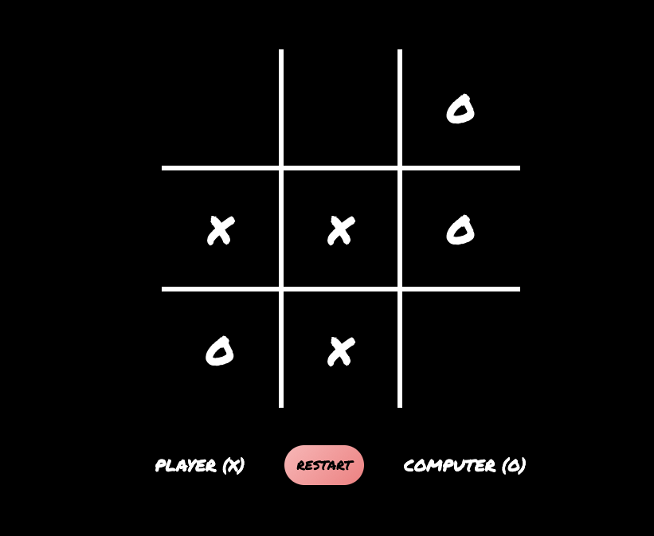
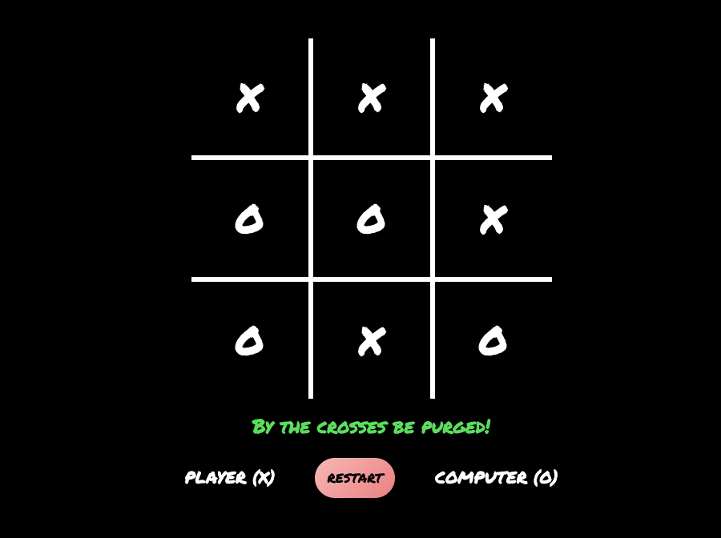
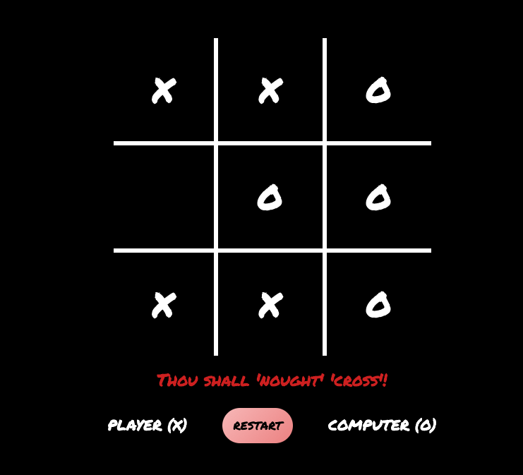

  <a href="#wave-welcome--introductions">Introduction</a>&nbsp;&nbsp;&nbsp;|&nbsp;&nbsp;&nbsp;
  <a href="#pushpin-objectives-of-the-project">Objectives</a>&nbsp;&nbsp;&nbsp;|&nbsp;&nbsp;&nbsp;
  <a href="#gear-technical-components">Technical Components</a>&nbsp;&nbsp;&nbsp;|&nbsp;&nbsp;&nbsp;
  <a href="#file_folder-upcoming-features">Upcoming Features</a>&nbsp;&nbsp;&nbsp;|&nbsp;&nbsp;&nbsp;
  <a href="#bookmark-attribution">Attribution</a>&nbsp;&nbsp;&nbsp;|&nbsp;&nbsp;&nbsp;
  <a href="#camera_flash-screenshots-of-the-game">Screenshots</a>&nbsp;&nbsp;&nbsp;|&nbsp;&nbsp;&nbsp;
  <a href="#memo-disclaimer">Disclaimer</a>

## Tic-Tac-Toe

## :wave: Welcome & Introductions!

Welcome to my page and thanks for checking out my project.

Tic-tac-toe is a web app game project that is built on HTML5, CSS3, ES6+ vanilla JS. Most features of this game app utilizes the DOM manipulation to respond and renders user interaction.

Have fun & feedbacks on this project are always welcome!

## :pushpin: Objectives of the project

* Design logic for winning & visually display which player won

* Switch turns between more than one player

* Use semantic HTML5 & CSS3 markup

* Use Javascript for DOM manipulation

* Render the game in the browser

And lastly, deploy the game online where the rest of the world can access it!  _**Happy coding!🚀**_

_P.S:_ _**Hover state features is not applicable on touchscreen devices, as it is only available through hovering over with a cursor, such as a mouse device.**_

## :gear: Technical Components

* Flexbox & Grid for page layout

* Hover & active states for the interactive elements of the page

* Functionality features through manipulation of the DOM, using Javascript and Event Handlers

## :file_folder: Upcoming features

* Keep track of multiple game rounds with a win and tie counter

* Game customizable options, time limits, board size, game rounds, name & profiles

* Customizable user tokens (X, O, name, picture, avatar)

* In-game sound effects

_P.S:_ _**This is a non-exhaustive list. More features might be added to this list in the future as improvements are made to the game.**_

## :bookmark: Attribution

[Icons made by Freepik on Flaticon](https://www.flaticon.com/authors/freepik/ "Flaticon.com")

## :camera_flash: Screenshots of the game

#### Player X victory

#### Computer O victory

## :memo: Disclaimer
The contents of these pages are provided as an information guide only. While every effort is made in preparing the material for publication, no responsibility is accepted by or on behalf of the owner for any errors, omissions or misleading statements on these pages or any site to which these pages connect. Although every effort is made to ensure the reliability of listed sites this cannot be taken as an endorsement of these sites.
